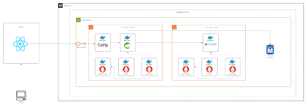
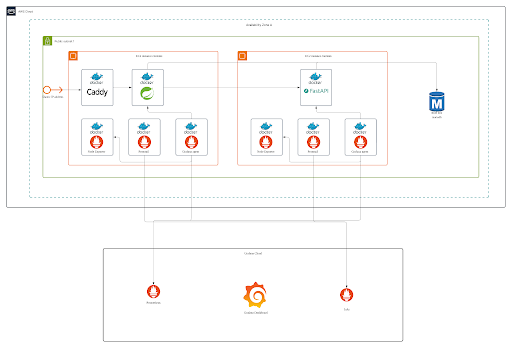
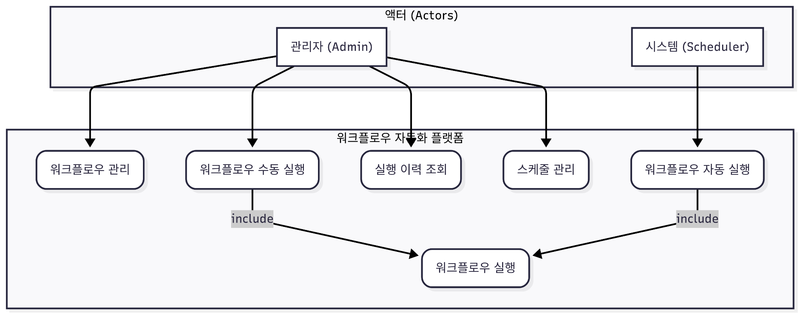
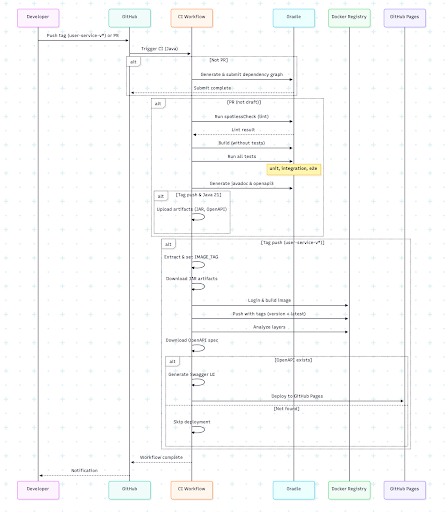
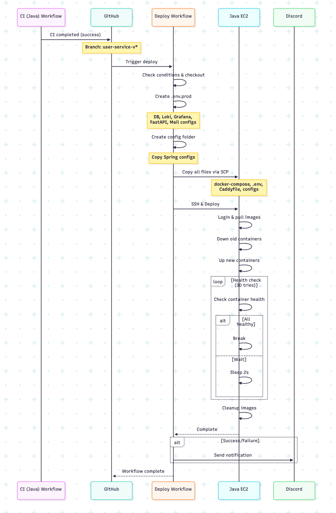
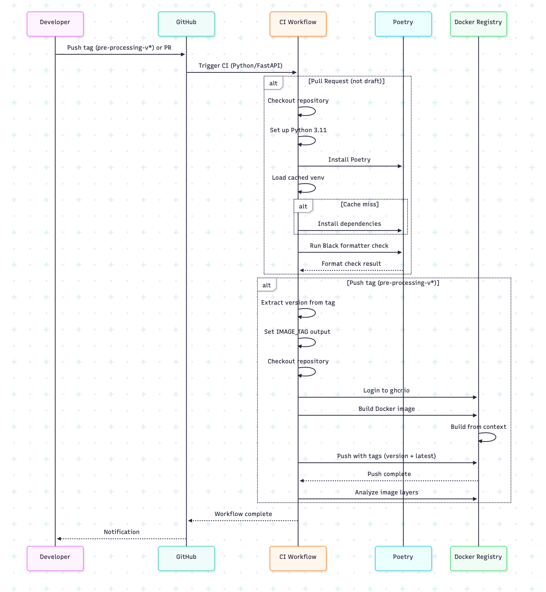
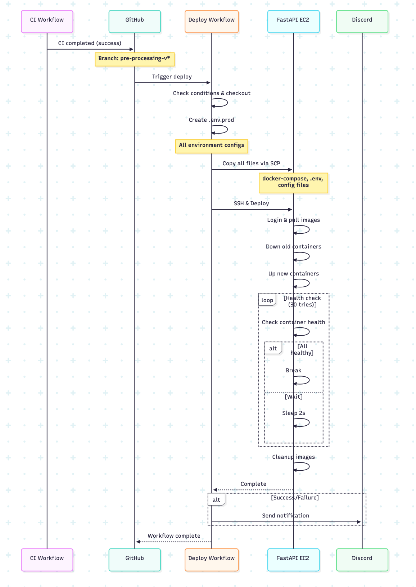

# 동적 워크플로우 자동화 플랫폼

### AI 기반 워크플로우 오케스트레이터를 활용한 RAG 기반 블로그 콘텐츠 자동화 시스템

---

### 목차

1. [서비스 개요](#1-서비스-개요)
2. [주요 기능](#2-주요-기능)
3. [데이터 베이스 설계(ERD)](#3-데이터베이스-설계-erd)
4. [시스템 아키텍처](#4-시스템-아키텍처)
5. [유스케이스 다이어그램](#5-유스케이스-다이어그램)
6. [시퀀스 다이어그램](#6-시퀀스-다이어그램)
7. [기술 스택](#7-기술-스택)
8. [주요 구성 요소 및 역할](#8-주요-구성-요소-및-역할)
9. [프로젝트 디렉토리 구조](#9-프로젝트-디렉토리-구조)
10. [환경 변수 관리 전략](#10-환경-변수-관리-전략)
11. [시연 영상](#11-시연-영상)

---

## 1. 서비스 개요

최근 커머스 업계의 AI 기반 콘텐츠 자동화 트렌드에도 불구하고, 여전히 트렌드 분석, 상품 조사, 콘텐츠 생성 및 발행 등 각 단계에서 시간 소모적인 수작업이 필요합니다.

본 프로젝트는 이러한 비효율을 해결하기 위해, 특정 도메인에 국한되지 않고 다양한 비즈니스 프로세스를 자동화할 수 있는 확장 가능한 워크플로우 플랫폼을 구축하는 것을 목표로 합니다. 초기 MVP 모델로 RAG(검색 증강 생성) 기술을 활용한 블로그 콘텐츠 자동 생성 및 발행하는 마케팅 워크플로우를 구현했습니다.  

---

## **2. 주요 기능**

  * **워크플로우 자동화**: `Workflow → Job → Task`의 계층적 구조에 따라 복잡한 프로세스를 순차적으로 자동 실행합니다.
      * **대표 워크플로우**: **블로그 콘텐츠 자동 생성 및 발행**
          * 네이버 데이터 랩 트렌드 분석 → 싸다구몰 상품 정보 수집 → RAG 기반 AI 콘텐츠 생성 → 블로그 자동 발행
  * **동적 스케줄링**: API를 통해 재배포 없이 스케줄을 실시간으로 생성, 수정, 삭제할 수 있습니다.
  * **데이터 파이프라이닝**: 이전 Task의 실행 결과(Output)를 다음 Task의 입력(Input)으로 동적으로 전달합니다.
  * **관리 및 모니터링**: 관리자 대시보드에서 워크플로우 실행 이력 및 결과를 실시간으로 모니터링하고, Grafana를 통해 서버 리소스를 시각적으로 확인합니다.

---

## 3. 데이터베이스 설계 (ERD)

서비스의 모든 데이터를 관리하고 워크플로우의 실행 상태를 추적하기 위해, 역할과 책임에 따라 정규화된 데이터베이스 스키마를 설계했습니다.

### 3.1. 최종 ERD

* **ERD 다이어그램**: [ERDCloud 바로가기](https://www.erdcloud.com/d/xkfSpzL2LrRQyCShx)

### 3.2. ERD 설명 및 설계 원칙

데이터베이스는 크게 **'워크플로우 정의', '실행 이력', '사용자 및 조직'** 세 가지 핵심 영역으로 구성됩니다.

#### **1. 핵심 도메인 테이블**
* **워크플로우 정의 계층**: `WORKFLOW`, `JOB`, `TASK` 및 관계 테이블(`WORKFLOW_JOB`, `JOB_TASK`)
* **실행 이력 계층**: `WORKFLOW_RUN`, `JOB_RUN`, `TASK_RUN`, `TASK_IO_DATA`, `EXECUTION_LOG`
* **사용자 및 권한 계층**: `USER`, `ORGANIZATION`, `ROLE`, `PERMISSION`

#### **2. JSON 타입을 활용한 동적 설정 관리**

워크플로우의 **유연성과 재사용성**을 극대화하기 위해, `TASK`와 `WORKFLOW` 테이블의 설정 관련 컬럼에 `JSON` 데이터 타입을 적극적으로 활용했습니다.

* **`TASK` 테이블의 `parameters` 컬럼**:
    * **역할**: Task의 **'정적 설계도(Blueprint)'** 역할을 합니다.
    * **내용**: 해당 Task를 실행하기 위해 필요한 고정 정보(예: `endpoint`, `method`)와, Request Body의 **구조 및 각 필드의 데이터 타입**을 JSON 형태로 정의합니다.
    * **예시**: `{"endpoint": "/keywords/search", "method": "POST", "body": {"tag": "String"}}`

* **`WORKFLOW` 테이블의 `default_config` 컬럼**:
    * **역할**: 워크플로우가 실행될 때 각 Task에 주입될 **'동적 설정값(Dynamic Configuration)'** 역할을 합니다.
    * **내용**: JSON 객체 형태로, `key`는 `task_id`, `value`는 해당 Task에만 적용될 설정값을 가집니다. 이 값은 `TASK`의 `parameters`에 정의된 구조를 덮어쓰거나(override) 보완합니다.
    * **예시**: `{"1": {"tag": "google_trends"}, "2": {"some_param": 123}}`

* **JSON 타입 채택 이유 (유연성 및 재사용성)**:
    * **스키마 변경 없는 확장**: 만약 새로운 Task에 `timeout`이라는 파라미터가 추가되더라도, DB 스키마를 변경(`ALTER TABLE`)할 필요 없이 `parameters` JSON의 내용만 수정하면 됩니다. 이는 잦은 변경과 확장이 예상되는 플랫폼에서 **변경에 대한 유연성**을 극대화합니다.
    * **Task의 재사용성 증대**: `TASK`는 순수한 '템플릿'으로 존재하고, 실제 동작에 필요한 구체적인 값은 `WORKFLOW`의 `default_config`를 통해 주입됩니다. 이 덕분에 동일한 '키워드 검색 태스크'를 A 워크플로우에서는 `naver`로, B 워크플로우에서는 `google_trends`로 **재배포 없이** 다르게 동작시킬 수 있어 **Task의 재사용성**이 크게 향상됩니다.
    * **구조적 데이터 저장**: 단순 `TEXT` 타입과 달리, Key-Value 형태의 구조적인 데이터를 저장할 수 있어 애플리케이션에서 데이터를 파싱하고 사용하기 용이합니다.

#### **3. 기타 설계 원칙**

* **네이밍 컨벤션**: 일관성을 위해 테이블 이름은 **단수형**(`user`, `workflow`)으로, PK는 `[table_name]_id` 형식(`workflow_id`)으로 통일했습니다.
* **외래 키(FK) 제약 조건 미설정**: 물리적인 FK 제약 대신 **애플리케이션 레이어에서 참조 무결성을 보장**하여, 데이터 마이그레이션과 배포 유연성을 확보했습니다.
* **인조키(Surrogate Key) 사용**: 다대다 관계의 중간 테이블에도 독립적인 인조키를 PK로 사용하여 **JOIN 성능을 향상**시키고 유지보수성을 높였습니다.

---

## 4. 시스템 아키텍처

역할과 책임을 명확히 분리하기 위해 `Spring Boot`가 **Orchestrator**, `FastAPI`가 **AI Worker** 역할을 수행하는 이중 레이어 아키텍처를 채택했습니다.

* **Spring Boot (Orchestrator)**: `Workflow → Job → Task` 구조를 기반으로 전체 비즈니스 흐름을 제어합니다. 스케줄링(`Quartz`), 상태 관리, 데이터 영속성, 인증/인가 등 핵심 로직 담당.
* **FastAPI (Worker)**: 키워드 추출, 상품 검색, 웹 크롤링, AI 연동(RAG), OCR 등 Python 생태계 특화 작업을 담당.




---

## 5. 유스케이스 다이어그램

시스템의 주요 액터는 **관리자(Admin)** 와 **스케줄러(Scheduler)** 입니다.
관리자는 워크플로우와 스케줄을 관리하고 수동 실행이 가능하며, 스케줄러는 자동 실행을 담당합니다.



---

## 6. 시퀀스 다이어그램

### 6.1. 워크플로우 실행 흐름 (스케줄/수동)

1. **트리거**: Quartz 스케줄러 또는 사용자의 `POST /v0/workflows/{id}/run` 요청으로 워크플로우 실행 시작
2. **비동기 실행**: `WorkflowController`가 `WorkflowExecutionService`를 `@Async`로 호출하고 즉시 `202 Accepted` 응답
3. **오케스트레이션**: `WorkflowExecutionService`가 Job, Task 순차 실행 및 `TaskExecutionService`에 재시도 위임
4. **외부 API 호출**: `FastApiTaskRunner`와 `FastApiAdapter`를 통해 FastAPI와 통신
5. **결과 기록**: 모든 실행 결과는 DB에 기록되며, 실패 시에도 다음 작업은 계속 진행

#### 수동 실행

.png)

#### 스케줄 실행

.png)

### 6.2. CI/CD 파이프라인

GitHub Actions 기반으로 빌드 → 테스트 → Docker 빌드 및 푸시 → EC2 배포까지 자동화되어 있습니다.






---

## 7. 기술 스택

### Backend (Orchestrator - `user-service`)

* **Language & Framework**: Java 21, Spring Boot 3.5.4
* **Data Access**: MyBatis 3.0.5, MariaDB Java Client 3.3.3
* **Scheduling**: Spring Quartz
* **Resilience**: Spring Retry
* **Security**: Spring Security
* **Build Tool**: Gradle

### Backend (Worker - `pre-processing-service`)

* **Language & Framework**: Python 3.11, FastAPI 0.116.2
* **AI & ML**: Transformers, Scikit-learn, OpenAI API
* **Web Scraping & OCR**: BeautifulSoup4, Selenium, Google Cloud Vision
* **DB & Translation**: SQLAlchemy, Deep-Translator
* **Package Manager**: Poetry

### Database

* **MariaDB 11.4**

### DevOps & Monitoring

* **Containerization**: Docker, Docker Compose
* **CI/CD**: GitHub Actions
* **Monitoring**: Prometheus, Grafana
* **Migration**: Flyway
* **Logging**: Log4j2

---

## 8. 주요 구성 요소 및 역할

* **WorkflowExecutionService**: 워크플로우 전체 실행 흐름 제어
* **TaskExecutionService**: Task 실행 및 재시도 정책 관리
* **TaskBodyBuilder (전략 패턴)**: 각 Task별 동적 Request Body 생성
* **WorkflowContextService (퍼사드 패턴)**: 각 TaskBodyBuilder가 이전 Task의 결과를 조회할 때 필요한 복잡한 DB 접근 로직(TaskIoDataMapper 사용 등)을 캡슐화하고, 단순화된 인터페이스를 제공하는 퍼사드(Facade) 역할
* **FastApiAdapter**: FastAPI 서버 통신 캡슐화
* **QuartzSchedulerInitializer**: DB 스케줄 정보 Quartz 엔진 동기화
* **ExecutionMdcManager**: 비동기 환경에서도 traceId 기반 분산 추적 로깅

---

## 9. 프로젝트 디렉토리 구조

Monorepo 형태로, `apps` 하위에 서비스별 디렉토리가 존재합니다.

```bash
FlowWeaver/backend/
├── apps/
│   ├── user-service/          # Java/Spring Boot 서비스
│   └── pre-processing-service/# Python/FastAPI 서비스
├── docker/                    # Docker 설정
├── .github/                   # GitHub Actions (CI/CD)
└── logs/                      # 로그 파일
```

### user-service (Spring Boot)

도메인 중심 아키텍처 적용. 각 도메인이 자체 구성요소를 포함.

```bash
user-service/
├── src/main/java/site/icebang/
│   ├── domain/        # 도메인 로직
│   ├── external/      # 외부 API 연동
│   ├── global/        # 글로벌 설정
│   └── common/        # 공용 유틸리티
└── Dockerfile
```

### pre-processing-service (FastAPI)

```bash
pre-processing-service/
├── app/
│   ├── api/               # 엔드포인트
│   ├── service/           # 비즈니스 로직
│   ├── core/              # 핵심 설정
│   ├── db/                # DB 관련
│   └── utils/             # 유틸리티
└── pyproject.toml
```

---

## 10. 환경 변수 관리 전략

추후 작성 예정

* **FastAPI (`pre-processing-service`)**:
* **Spring Boot (`user-service`)**:

---

## 11. 시연 영상

[https://www.youtube.com/watch?v=1vApNttVxVg](https://www.youtube.com/watch?v=1vApNttVxVg)
[](https://www.youtube.com/watch?v=1vApNttVxVg)
